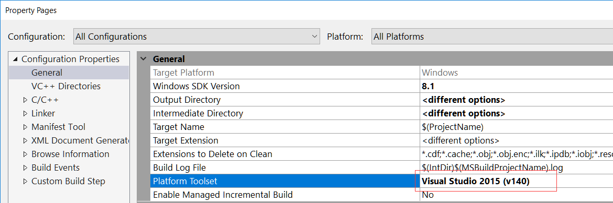

# **Qt源码在VC环境下编译（以VC14下Qt5.9.1和Qt5.4.0为例，包含icu和QtWebkit模块）**

#### *2017年11月26日*

## **ICU57 + Qt5.9.1 + QtWebKit在VC14下编译**

### 编译所需工具

| 工具        | 下载地址                                                                                                 |
| ----------- | -------------------------------------------------------------------------------------------------------- |
| Qt Source   | [https://download.qt.io/archive/qt/5.9/]()                                                               |
| VS Compiler | [https://docs.microsoft.com/en-us/visualstudio/install/create-a-network-installation-of-visual-studio]() |
| Python      | [https://www.python.org/downloads/]()                                                                    |
| Ruby        | [https://www.ruby-lang.org/en/downloads/]()                                                              |
| Perl        | [https://www.perl.org/get.html]()                                                                        |
| ICU         | [http://site.icu-project.org/download]()                                                                 |

---

### 总览（以Qt5.9.1_VC14_release_64bit为例）

- 工具环境
    - 确保编译工具安装目录为默认目录（C盘），并已将bin路径加入Windows系统环境变量Path
    - 编译目录结构

        ```
        Root
        |
        |-- 5.9.1_x64.bat
        |-- ICU_57
        |   |
        |   `--icu
        |       |-- include
        |       |-- lib64
        |       |-- bin64
        |       `-- ...
        `--qt-everywhere-opensource-src-5.9.1
            |
            |--qtwebkit
            `-- ...
        ```

- 编译脚本（5.9.1_x64.bat）
    ```bat
    REM Set up VC14 Tools Command Prompt
    CALL "C:\Program Files (x86)\Microsoft Visual Studio 14.0\VC\vcvarsall.bat" amd64

    SET ROOT=%CD%
    SET QT_SOURCE=%ROOT%\qt-everywhere-opensource-src-5.9.1
    SET QT_WORKING=%ROOT%\5.9.1_vc14_64
    SET QT_INSTALL=%ROOT%\Qt\Qt5.9.1\5.9.1\msvc2015_64

    SET ICU_OPT=%ROOT%\ICU_57\icu
    SET ICU_INCLUDE=%ICU_OPT%\include
    SET ICU_LIB=%ICU_OPT%\lib64
    SET ICU_BIN=%ICU_OPT%\bin64

    REM Set perl, ruby and python path, for needing them to build the QtWebKit
    SET PATH=C:\Strawberry\c\bin;C:\Strawberry\perl\site\bin;C:\Strawberry\perl\bin;C:\Ruby24-x64\bin;C:\Python27amd64;%PATH%

    REM Set icu path, for needing it's dll to build something
    SET PATH=%QT_SOURCE%\qtbase\bin;%QT_SOURCE%\gnuwin32\bin;%ICU_BIN%;%PATH%

    REM Set the build working directory, so you can build 32/64 at the same time
    IF EXIST %QT_WORKING% RD /s /q %QT_WORKING%
    MKDIR %QT_WORKING%
    CD /d %QT_WORKING%

    REM Building Qt, Just build "qtbase" and "qttools"
    CALL %QT_SOURCE%\configure.bat -mp -release -shared -confirm-license -platform win32-msvc -opensource -prefix %QT_INSTALL% -icu -I %ICU_INCLUDE% -L %ICU_LIB% ICU_LIBS="icudt.lib icuuc.lib icuin.lib" -opengl desktop -nomake examples -nomake tests -no-dbus -skip qtmacextras -skip qtx11extras -skip qtimageformats -skip qtandroidextras -skip qtserialport -skip qtserialbus -skip qtactiveqt -skip qtxmlpatterns -skip qtsvg -skip qtdeclarative -skip qtremoteobjects -skip qtscxml -skip qtpurchasing -skip qtcanvas3d -skip qtgamepad -skip qt3d -skip qtwayland -skip qtconnectivity -skip qtwebsockets -skip qtwebchannel -skip qtsensors -skip qtmultimedia -skip qtspeech -skip qtdatavis3d -skip qtcharts -skip qtwinextras -skip qtgraphicaleffects -skip qtquickcontrols2 -skip qtquickcontrols -skip qtvirtualkeyboard -skip qtlocation -skip qtwebkit -skip qtscript -skip qtwebengine -skip qtwebview -skip qtnetworkauth -skip qttranslations -skip qtdoc

    PAUSE
    ECHO ON
    nmake && nmake install

    REM The current used ICU version is 57.1
    COPY /v /y %ICU_BIN%\icudt57.dll %QT_INSTALL%\bin\
    COPY /v /y %ICU_BIN%\icuin57.dll %QT_INSTALL%\bin\
    COPY /v /y %ICU_BIN%\icuuc57.dll %QT_INSTALL%\bin\

    PAUSE
    CALL %QT_WORKING%\qtbase\bin\qmake.exe %QT_SOURCE%\qtwebkit\Webkit.pro
    nmake && nmake install
    ```

- 若编译工具都按要求安装，ICU和Qt的源码也按照相应的目录结构放置，执行5.9.1_x64.bat脚本即可编译Qt的qtbase, qttools, qtwebkit模块
- 倘若编译失败，请阅读完全文

---

### Qt Source

- 解压```qt-everywhere-opensource-src-5.9.1.zip```

- 下载 QtWebKit 模块 [https://download.qt.io/archive/qt/5.9/5.9.1/submodules/qtwebkit-opensource-src-5.9.1.zip]()
    - 将```qtwebkit-opensource-src-5.9.1.zip```解压，文件夹改名为qtwebkit并复制到qt-everywhere-opensource-src-5.9.1文件夹下

- 目录树如下所示

    ```
    qt-everywhere-opensource-src-5.9.1
    |
    |-- ...
    |-- gnuwin32
    |-- qtbase
    |   |-- configure.bat
    |   |-- config_help.txt
    |   |-- configure.exe
    |   `-- mkspecs
    |       |
    |       |-- win32-msvc
    |       |-- common
    |           |
    |           `-- msvc-desktop.conf
    |-- qtwebkit
    |   | 
    |   |-- 
    |   `-- ...
    |-- qtwebengine
    |-- configure.bat
    |-- README
    `-- ...
    ```

- 编译流程简述
    1. 执行根目录下的```configure.bat```脚本，在该脚本中会调用qtbase下的```configure.bat```，而此脚本又会调用同目录下的```configure.exe```
        1. 在旧版本的qt源码中，会在```qtbase\tools\```目录下看到有个configure的项目，```configure.exe```正是由该项目编译所得。但在Qt5.9.1的源码中会发现整个tools目录都被移除。（此外还有个```对qt库的可视化裁剪工具```的项目也找不到，不知道是移除还是移动到了其他文件夹。）
        2. 编译qt时，需要使用的是根目录下的```configure.bat```加上编译参数来进行编译

    2. 在跟目录和qtbase目录下会发现各存在一个```configure```文件，此文件为在Linux/Unix系统下编译时使用，在Windows系统下无论你在命令行中输入configure或者configure.bat都会执行```configure.bat```这个脚本

    3. 根目录下的```README```和qtbase目录下的```config_help.txt```对编译源码所需的工具以及对Qt源码库的定制参数做出了详细的介绍
        1. ```REAME```文件主要介绍所需要编译工具以及其最低版本
            - 可在其中看到以下字段
                ```
                Perl version 5.12 or later   [http://www.activestate.com/activeperl/]
                Python version 2.7 or later  [http://www.activestate.com/activepython/]
                Ruby version 1.9.3 or later  [http://rubyinstaller.org/]
                ```
            - 由于官方发布的Qt5.9.1版本中已经移除了QtWebkit模块，故在```README```中没有看到ICU的版本需求说明。（本人使用57.1，有空的同学可以去尝试下其他版本的ICU）
                ```
                ICU version 57.1  [http://site.icu-project.org/download/57#TOC-ICU4C-Download]
                ```
        2. ```config_help.txt```则对Qt库自身的编译参数作出了说明
            - 第三方库的include，lib文件夹以及libs文件名配置（使用opengssl，icu等库编译时会用上此部分）
                - 在```config_help.txt```中可看到以下说明，
                    ```
                    Usage:  configure [options] [assignments]
                    Configure understands variable assignments like VAR=value on the command line.
                    Each uppercased library name (obtainable with -list-libraries) supports the
                    suffixes _INCDIR, _LIBDIR, _PREFIX (INCDIR=PREFIX/include, LIBDIR=PREFIX/lib),
                    _LIBS, and - on Windows and Darwin - _LIBS_DEBUG and _LIBS_RELEASE. E.g.,
                    ICU_PREFIX=/opt/icu42 ICU_LIBS="-licui18n -licuuc -licudata".
                    ```   
                    - 按照安装文档使用```ICU_INCLUDE="icu_dir"```这种方法配置include和lib文件夹时并不能生效（在编译前检查时会报错），但是可以使用```ICU_LIBS="icudt.lib icuuc.lib icuin.lib"```来配置需要链接的lib文件。因此最终选择使用
                        - ```-I "icu_include_dir"``` 配置include路径
                        - ```-L "icu_lib_dir"``` 配置lib路径
                        - ```-l "icudt" -l "icuuc" -l "icuin"```配置lib文件
                - 此外也可以使用```SET VARIABLE=VALUE```这种方式配置include和lib路径
                    - ```SET INCLUDE=%INCLUDE%;%ICU_DIST%\include```
                    - ```SET LIB=%LIB%;%ICU_DIST%\lib```
                    >上面两行相当于在旧的路径上加上了icu的include和lib路径
            - 仅编译部分Qt库（对Qt库裁剪）
                - ```-nomake <part>```
                    > part主要为examples, tests
                - ```-skip <module>```
                    > 基本在源码根目录下的每个一个文件名都为一个module（除了 coin 和 gnuwin32）
                - ```-no-dbus```可以去除进程通信相关的一个库
                - ```-no-feature-<feature>``` 去除某些feature，本人没有用过该功能
                - 当需要编译QtWebkit时，可修改编译配置相关源码进行裁剪
                    > [[Qt5] 减少dll依赖和大小(特别是webkit的大小和依赖)](http://www.cnblogs.com/lingdhox/p/3685360.html)
            - 其他编译参数
                - ```-opengl <api>```
                    > Windows下常用的参数为```Desktop```，嵌入式绝大多数为```es2```
                - ```-static-runtime```会把windows的runtime库静态链接到Qt库的dll中，也即是说在没有安装runtime库的机器上，仅有Qt的dll也可以运行程序
                - ```-platform <target>```
                    > qtbase\mkspecs目录下的每一个文件夹名为一个```target```，例子中使用```win32-msvc```这个```target```进行编译
                - 编译 Debug 和 Release 版本
                    - -release
                    - -debug 
                    - -debug-and-release
                    > 三个参数三选一即可，（如需要Release版本下的pdb文件，需加上```-force-debug-info```）
                - 编译 静态库 或 动态库
                    - ```-shared``` 动态库
                    - ```-static``` 静态库（注意与```-static-runtime```的差别，```-static```意为编译出来的Qt库为静态库， 而```-static-runtime```则是Qt库静态链接VC运行时库）
                    > 本人开发的为大型Windows桌面程序，故而仅需编译动态库，也未曾尝试编译静态库。但按照本文方法编译静态库应该不会有太大问题。

### VS2015 或者 VS2017

- 安装
    - Visual Studio的安装只需要机器可以联网，一键安装即可，这里就不在多做介绍。

- VS2017中使用VC14的编译工具报错问题
    - 由于VS2017中集成了VC14编译器，而且VS2017可选择安装目录，可配置安装模块等等，有些同学更倾向于仅安装了VS2017。在此环境下使用VC14编译工具会有些小问题，这应该是M$工程师留下的小Bug。
    - 无论是在Start菜单中点击VS2015 x64 Native Tools Command Prompt还是使用命令行，最终都会使用```C:\Program Files (x86)\Microsoft Visual Studio 14.0\VC\vcvarsall.bat```这个bat脚本来初始化VC编译环境。该脚本中有以下代码
        ```bat
        @echo off
        REM VC command prompt depends on env. variable installed during VS. This causes VC command prompt to break for C++ Build SKU.
        REM So if VS is not installed and C++ Build SKU is installed, set appropriate environment for C++ Build SKU by calling into it's batch file.
        REM C++ Build SKU supports only desktop development environment.

        if exist "%~dp0..\common7\IDE\devenv.exe" goto setup_VS
        if not exist "%~dp0..\common7\IDE\wdexpress.exe" goto setup_buildsku

        :setup_VS
        ```
        - 调用此脚本时会在```if exist "%~dp0..\common7\IDE\devenv.exe" goto setup_VS```处中断
        - 这是因为仅安装了VS2017，也即是说机器中只有VS2017那一份IDE，所以在```C:\Program Files (x86)\Microsoft Visual Studio 14.0\common7\IDE\```文件夹下是不会有```devenv.exe```这个文件。(```%~dp0```代指bat脚本文件所在文件夹)
        - 解决方法，将这两句判断的语句注释掉即可
            ``` bat
            REM if exist "%~dp0..\common7\IDE\devenv.exe" goto setup_VS
            REM if not exist "%~dp0..\common7\IDE\wdexpress.exe" goto setup_buildsku
            ```

### Python Ruby Perl
1. 在qtbase\bin文件夹下看到两个后缀为pl的文件，在编译qtbase模块时应该需要Perl这个工具。

2. 而在安装过程中，并没有仔细研究过编译的log，此外也没有时间去阅读Qt源码。这些工具都是为了编译哪些模块则不是太清楚。唯一确定是，如果你想编译QtWebKit模块，Python Ruby Perl 和 icu 是必须全部安装的。

3. QtWebKit依赖于Qt的其他模块，若没有编译那些模块就编译QtWebKit会把那些模块全部编译到QtWebKit.dll中。（此项是我想当然猜的，有兴趣的同学可以去研究一下，告诉下我正确答案）

### ICU
- 如果不需要编译QtWebKit库，这个库完全不需要安装。

- 在网上搜索各种关于Qt icu的信息，各种搜索结果搜搞得好复杂，有些设置要求你在Windows下安装一个Linux环境。也许是由于搜索了"Qt icu"，所以搜索结果就变得复杂了；也有可能是我水平太低，在这之前并不知道ICU是一个编码转码库...

- 在官方中下载到ICU的源码解压后，可得到以下目录结构的文件

    ```
    icu
    |
    `--source
        |
        `allinone
            |
            `--allinone.sln
    ```

    - 使用VS2015/VS2017打开```allinone.sln```这个解决方案，可看到工程中配置的编译器版本为VC10

        
        
    - 除了makedata这个工程以外，其他工程全部升级VC14

        

    - 右键点击Solution 'allinone'，然后Build Solution
        - 在Qt开发过程中无需对ICU库Debug，而且编译Debug/Release版本的Qt库时都可使用Release版本的ICU，因此，我们仅需要编译32/64bit的Release版本的ICU库
        - Qt中仅使用```icudt57.dll(stubdata), icuuc57.dll(common), icuin57.dll(i18n)```这三个dll，本人贪图方便就整个Solution都进行编译了。但复制资源，仅复制这三个文件到Qt的安装目录下的bin文件夹即可。
    - 若ICU编译成功，可得到icu目录下会多出以下文件夹
        ```
        icu
        |
        |--source
        |   |
        |   `allinone
        |       |
        |       `--allinone.sln
        |
        |--include
        |--lib
        |--bin
        |--lib64
        `--bin64
        ```


### 编译脚本编写


### *Markdown Src：*  https://github.com/joshion/CSDN.git

### *Referene*
1. [ Visual Studio 2015编译安装配置QT5.5.1(含QTWEBKIT)](http://blog.csdn.net/liuyez123/article/details/50339865#comments)

2. [msvc2013编译qt5.6源码](http://www.cnblogs.com/swarmbees/p/5930202.html)

3. [自编译QT中的ICU库问题](https://www.tuicool.com/articles/2qYRfe)

4. [用msvc2008编译qt5.4.0](http://blog.csdn.net/mkdym/article/details/48223489)

5. [[Qt5] 减少dll依赖和大小(特别是webkit的大小和依赖)](http://www.cnblogs.com/lingdhox/p/3685360.html)

6. [VS2017自带VS2015编译器等在命令行下无法使用问题](http://www.cnblogs.com/oloroso/p/6404475.html)

7. [Create an offline installation of Visual Studio 2017](https://docs.microsoft.com/en-us/visualstudio/install/create-an-offline-installation-of-visual-studio)

8. [Bat命令学习](http://www.cnblogs.com/SunShineYPH/archive/2011/12/13/2285570.html)