# **优雅地使用Visual Studio 20\*\* 以及 Visual Studio Code**

## **Abstract**

    Visual Studio 201\*是宇宙第一IDE，Visual Studio Code是世界第一编辑器，而Beyond Compare是最好的对比工具。不接受辩论。

## **1. VS2017的功能探索以及个人使用的VSIX插件**

### 1.1 字体

1. 有人会说，无论我在Coding时使用什么字体，最终存在电脑的上的二进制都是一样的，并不会影响程序的编译运行。此话诚然不错，殊不知在你Coding时使用的字体会影响着代码的阅读以及编码出错的几率。

1. 等宽字体以及非等宽字体

    1. 以下给出等宽和非等宽各两种字体的对比。在下面四幅图中可看出，等宽字体的每个字符的宽度是一样的，而非等宽字体的则各异。以非等宽字体Arial为例，同样是8位的16进制数字，```8个1``` 比 ```8个9``` 少了一个字符的宽度。若你在调试程序调试到心情烦躁时，相信你有可能把```8个9```误以为是```9个9```，又或者将```8个1```误以为是```7个1```。而```L```和```i```的对比就更加恐怖了，```8个L```的宽度足足是```8个i```的两倍。在编程过程中因为这些打字错误而浪费大量时间去debug是十分不值得的。

        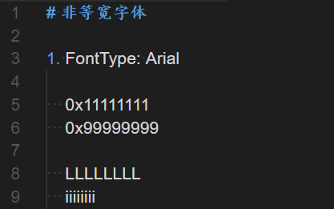

        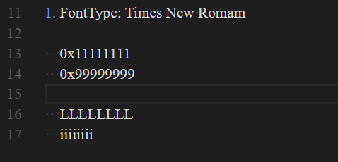

        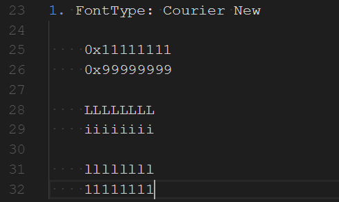

        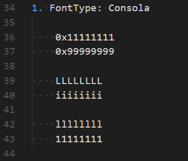

    1. 推荐使用的两款等宽字体。当然也可凭个人喜好其他字体，但强烈推荐等宽字体。在VS中选择字体时，所有的等宽字体会以```粗体```进行标志出来。在Linux环境工具中，由于字体库本来就少，而```Courier New```的粗体可以说是相当不错的的一款等宽字体，所以本人一直使用的都是这款字体。然而这款字体也有所缺陷，如```0```和```O```、```l```和```1```的辨识度不高；字体的宽度比较大从而每行显示的代码量不多；不够美观等。而```Consola```字体则在一定程序弥补上以上缺陷。下图是这两种字体的比较，```Consola```的```0```中间多了一道斜杠，```1```顶上的一横也变成了45°倾斜，字体也不像```Courier New```那么扁。经过Windows 10的ClearType调节后，```Consola```也没有了Windows 7上的边缘模糊现象。

        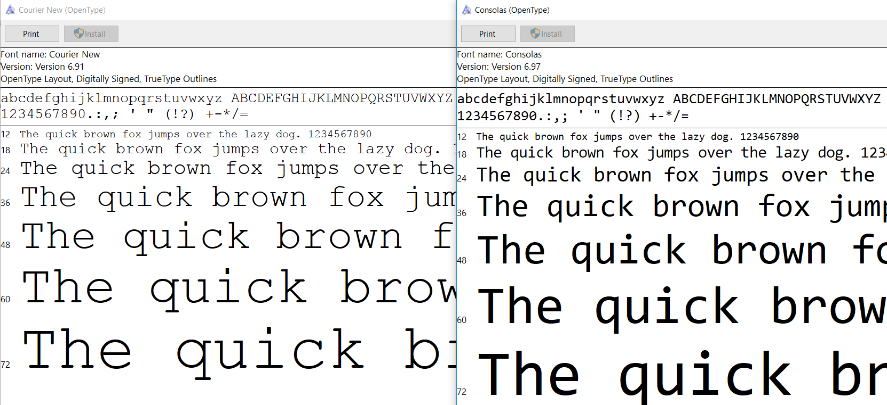

    1. 关于标点符号的错误。一般都是使用了全角的中文标点符号。这种错误都会有提示，比较容易解决。

### 1.2 高亮

1. 语法高亮仅仅是程序员因为黑白的命令行界面太单调了，所以给以一些色彩那么简单吗？其实在那些花花绿绿的颜色里面包含着许多语法信息，通过这些语法信息可以更容易定位问题。也许有人会辩解，语法信息会包含在命名规则里面。（别天真了，人才是最不可靠的东西！还是那个编程原则"SOP"，当你在因为某个变量命名不规范而破口大骂时，往往会在查看代码历史记录时发现那是自己拉下的屎。）下图是本人使用的配色方案，由于习惯了Linux下的命令行的黑色背景以及白色太过于刺眼，因而选择了深灰色为背景颜色。而字体的前景颜色也是在RBG以及RGB的两两配对的基础上加深弄暗的一组颜色，个人主观上感觉这套配色方案的辨识度还是比较高的。若你觉得这套配色方案难看，可自行在VS的Tools->Options中自行设置，不推荐VA的配色方案，只有简单的四种颜色，不足以将各种变量、函数区分开来。

    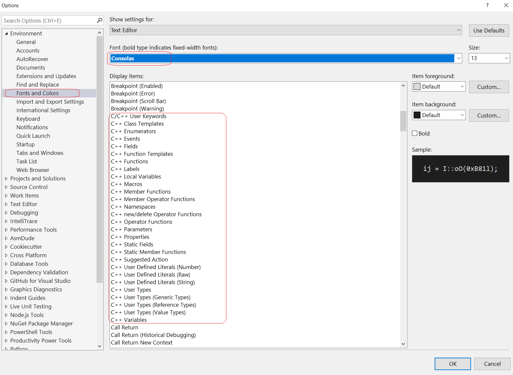

    1. 函数参数、Local本地变量、类的成员变量、类的静态变量、外部全局变量分别给以深灰色、灰白色、橄榄色、黄色、褐红色。通过这些颜色的区分，可以很快速的明确某个变量的作用域，从而知道该把精力放在哪些变量上，又或者可以马上知道应该在调试的Auto窗口还是Local窗口查看这个变量。

    1. 外部函数、类成员函数、 类静态函数、 模板函数分别给以了灰白色、橙色、黄色、棕褐色。 在一个类的成员函数里，对于自身的类成员函数调用是不大可能用```this->func()```这种的写法，而且为了代码的简短，也不太推荐这种写法，所以为了区分各类函数就需要赖以颜色区分。区分各类函数有何好处？例如，若类成员函数调用了外部函数，一般关注点在于这个函数的参数以及返回值；而若调用的是本来的成员函数，那么就要留意调用的函数里面会不会改变了某些类成员变量的值。

    1. 而内置类型、自定义类型、模板类类型、宏、枚举也有各自的颜色

        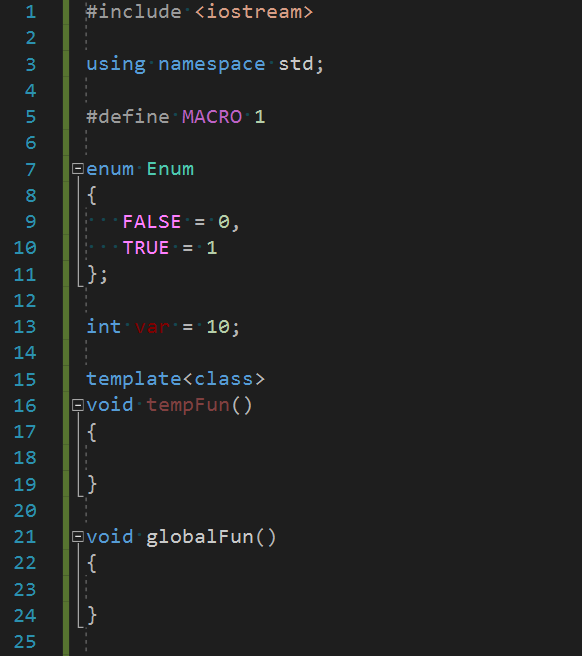

        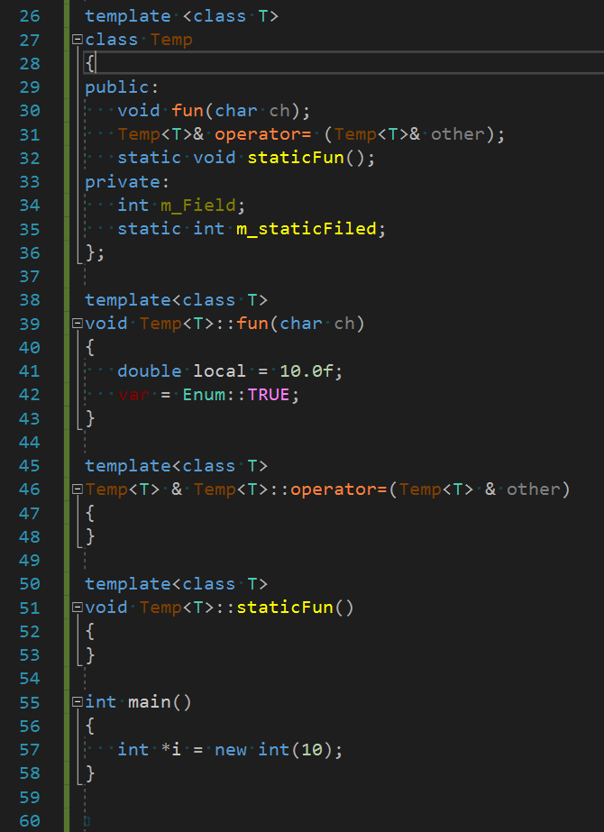

    1. 语法高亮，对于一些开源项目的源码阅读特别有用，开源项目的源码贡献来自不同的公司不同的国家，使用的命名规则，缩进方法等等都可能会有很大的差别。如下为icu的一段源码。 类成员变量、类静态变量都没有特殊的前缀，函数名首字母有的大写有的小写，若没有将每一种语法都用一种特殊的颜色来标志，就得一个个变量跳转查看了。

        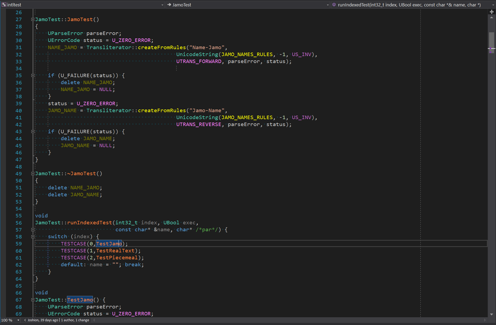

### Tab和空格

1. 自古以来，```"{}"```的换行缩进、Tab和空格就是圣战的根源所在。我并非想来引发战争，我仅是来阐述两派区别，从而在圣战中保存自身。首先要做的当然是看清楚形势。

    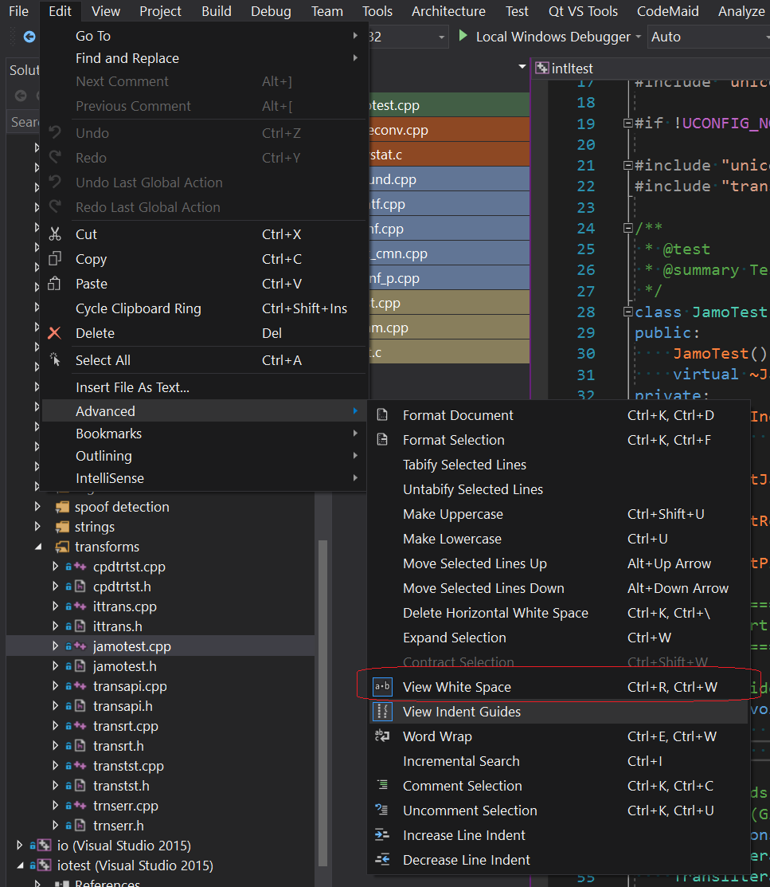

1. 战争是如何引起的？如果一个项目里面只有Tab缩进，或者只用Space缩进都不会有任何问题。甚至于一个项目里混用两种缩进方式，但是每个独立的文件里面仅用一种缩进方式。但是如果一个文件里面混用了两种缩进方式，那么将会给源码的阅读以及Review带来十分的不便。

    1. Tab宽度为4，Space缩进宽度也为4

        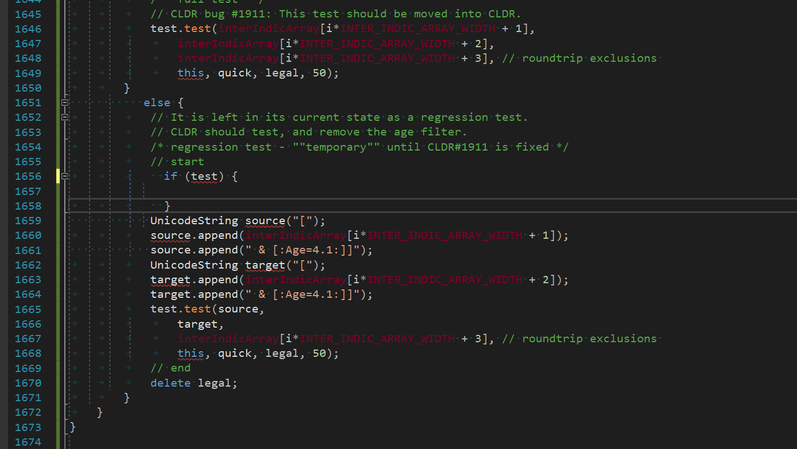

    1. Tab宽度为3（Space缩进宽度是不会有设置宽度的，一个空格就一个字符的宽度）。从下图可看出，同样的源码，但是由于Tab宽度设置的不一样造成有两行少缩进了3个字符宽度，这样很容易给人一种错觉：“下一行（缩进比较长）和上一行（缩进比较短）是同一条语句，由于太长了所以换行了”。甚至在某些情况下会看错if / else 等语句的作用域。

        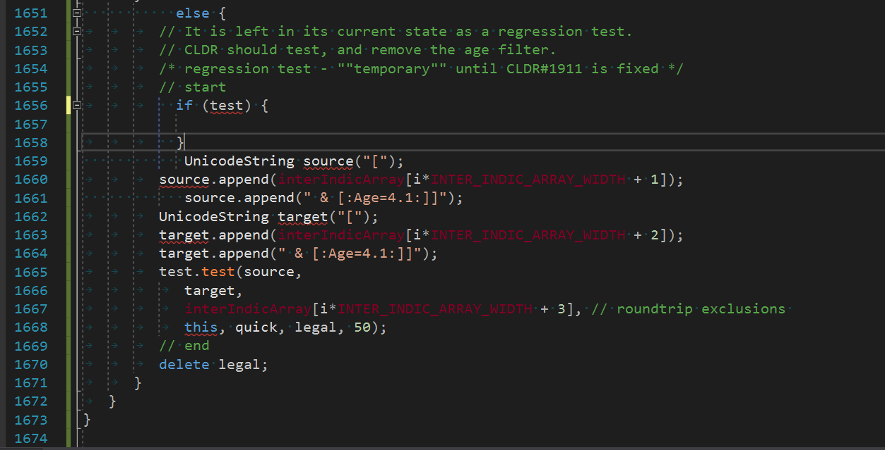

    1. Tab缩进的方式有个好处，只需要更改Tab的宽度就可以满足不同人的不同缩进宽度喜好(2/4/8)，也有奇葩的使用3个字符宽度的。从个人主观上来看，若你是新增文件，Tab空格随你意，这是个人的信仰自由。但是在修改别人的源码时，还是老老实实地打开了“空格可见”功能，依据旧有的上下文来选择缩进格式吧。

    1. 唯一一条必须要遵守的原则是，一个文件里面只允许一种缩进方式出现。

### 1.3 搜索

1. 主要为正则表达式的使用。

1. VA插件的模糊搜索功能，详见插件介绍

### 1.4 调试

1. Auto窗口、Local窗口、变量的Visualize文件编写

1. 断点种类、书签

1. 单语句的块

1. Error List 和 HelpViewer

### 1.5 插件

1. Open in Visual Studio Code

1. Indent Guides

1. Code Maid

1. Custom Document Well

1. Match Margin

1. Solution Error Visualizer

1. Visual Assistant

## **2. 使用Visual Studio Code编写、编译、调试C++程序**

### *Tools*

### **

## ***Reference***

1. [How to build and debug the Microsoft CppTools Extension](https://github.com/Microsoft/vscode-cpptools/blob/master/Documentation/Getting%20started.md)

1. [c_cpp_properties.json Reference Guide](https://github.com/Microsoft/vscode-cpptools/blob/master/Documentation/LanguageServer/c_cpp_properties.json.md)

1. [windows cmd批处理](http://blog.csdn.net/llq108/article/details/47169809)

1. [延迟环境变量扩展（bat）](http://www.cnblogs.com/dongzhiquan/archive/2012/09/05/2671218.html)

1. [g＋＋编译命令选项](http://blog.csdn.net/woshinia/article/details/11060797)