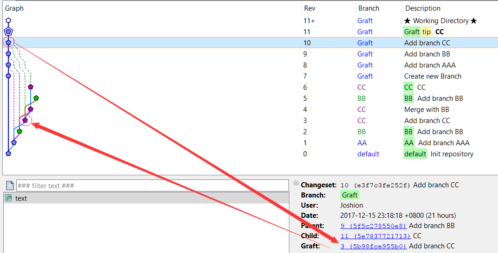
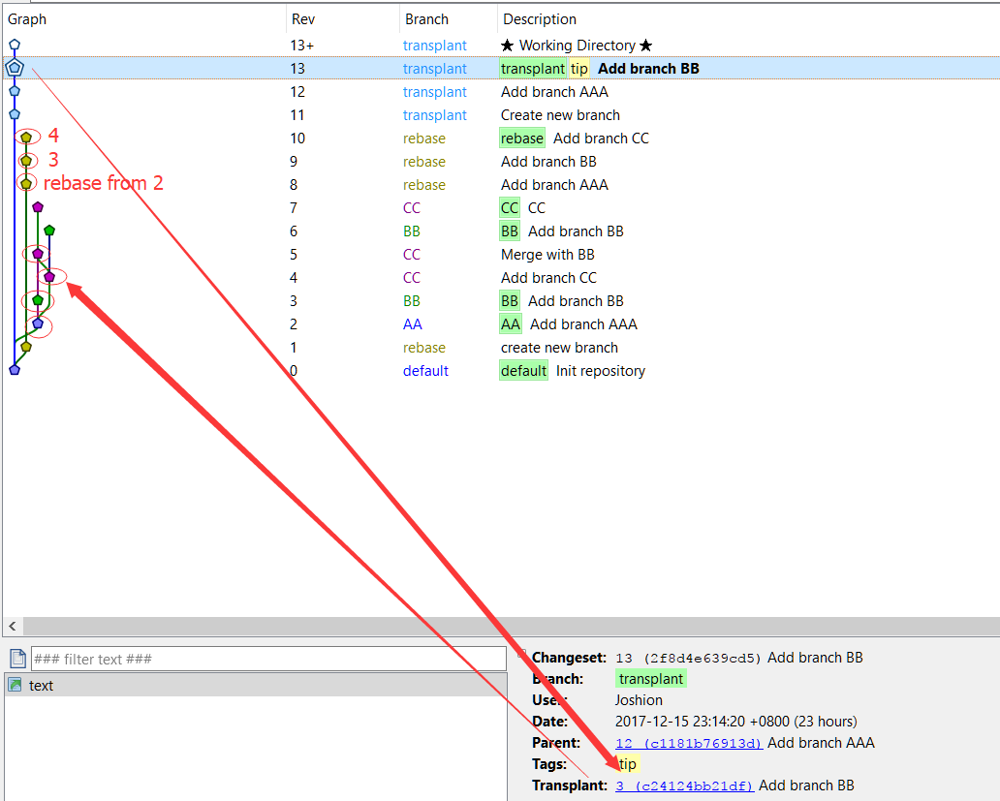

# Choice of commands, Model of branch, Difference between Git and Hg(Mercurial)

## **Some Version Control**

### *```SVN``` and ```CVS```*

> 传统版本控制系统（中心存储库模式）。CVS(Concorrent version system)，就目前情况来看，CVS应该已经被SVN替代（SVN都快要被其他分布式结构的版本管理软件所替代），这是一个比较古老的软件，就我而言，我是仅知道有这么一个软件，但是从未用过。SVN(Subversion)，作为一个为了代替CVS而开发出来的软件，但是仍是没有脱离原有的```中心存储库模式```框架，因而即使是一些小项目，一些仅有一个文件的项目，若你想使用SVN来进行代码管理，还是得先搭一下服务器。虽然SVN是我第一接触到的版本管理软件，但是稍后就转到Git去了（毕竟Github是宇宙第一男同性交友网站），故而对SVN的特性并没有什么了解，在此不再细说。

### *```Hg(Mercurial)``` , ```Git``` and ```Bazaar```*

> 分布式版本控制系统，简称DVCS。此三者都是基于分布式的设计，相比于SVN，这类的版本控制系统最突出的优点在于无需一个中心服务器（客户端和服务器可以在同一机器上）。可以随时随地在某一个文件夹下建立个仓库，再将这些文件添加到版本管理中，对于个人独立开发者，这个一个致命的诱惑。我想这也是Github能成为宇宙第一男同性交友网站的原因之一。

### *Others*

1. Gerrit
    > 基于git的一个代码review系统
1. BitKeeper
    > Linus在开发出Git之前使用其来管理Linux内核代码主线

## **Choice of commands**

> 本人日常使用的```DVCS```为Hg 和 Git，这两者虽然在某些特性上有所差别，但是在命令层次却是高度相似。而两者的差别，暂时没有做过全面的对比，无法给出一个系统的结果。这里也并非hg和git的使用教学，而是一些关于```可以实现同一个功能的不同命令操作时会得到的实际结果```的一些心得。在此以Hg为例（无可置疑，TortoiseHg的界面还是比TortoiseGit的好看那么一丢丢）

### hg, patch, diff and ref

> 在hg的使用的时，可以手动导出hg, patch, diff这三种"差异"文件，而在合并过程中无法解决冲突时，可能会生成一个ref的临时文件。 当我们在多个仓库之间交流（使用push和pull），需要传输的正是这些差异文件。

1. diff
    1. 导出(注意参数的先后顺序，最终得到的结果是以第一个参数的结点为基准，差异是第二个参数结点相对于第一参数结点的差异)

        ```bat
        hg diff -r [sREV] -r [otherREV] >> *.diff
        ```

    1. 导入

        ```bat
        hg import *.diff
        ```

1. patch /  hg
    1. patch
        1. 导出

            ```bat
            hg export -o "*.patch" -r [REV]
            ```

        1. 导入(patch / import)

            ```bat
            hg import "*.patch"
            ```

    1. hg
        1. 导出

            ```bat
            hg bundle -o "*.hg" -r [REV]
            ```

        1. 导入(patch / import)

            ```bat
            hg unbundle "*.hg"
            ```

1. ref

### merge, rebase and graft(transplant)

1. merge

1. rebase

1. graft / transplant
    > graft可以理解为保留原分支的复制merge，但是transplant和rebase的本质差别目前暂时还无法领悟。
    1. graft 使用merge，在保留原来结点的基础上，并将结点复制一份和当前结点相合并。使用graft可以追踪到这些结点从何处graft而来。
        - 
    1. transplant 类似于rebase，在保留原来结点的基础上，并将结点复制一份和当前结点相合并。该命令和```hg rebase -r [REV] -d [REV] -k```得到的应该是同样的结果，目前我发现两者之间的唯一差别在于transplant会留下原节点的历史，而rebase则不会。（在transplant有冲突时并不会调用three-way-merge，而是给出一个*.rej文件；而rebase对单个结点进行操作时发生冲突是会调用three-way-merge。）
        - 
    1. 使用命令```hg tranplant --help```可得到以下说明。由此，隐隐感觉官方也认为 ```transplant```是一个可有可无的命令。

        ```hg
            Consider using the graft command if everything is inside the same
        repository - it will use merges and will usually give a better result.
        Use the rebase extension if the changesets are unpublished and you want
        to move them instead of copying them.
        ```

### shelve, rollback and backout

1. shelve
    将当前workspace下的修改暂时储存在一个临时文件，可以稍后将这些改动拿回来。

1. rollback
    撤销最近的一次操作

1. backout
    1. 将想要的backout的结点与其父节点的差异import，可以得到与backout类似的结果

### others

> ```hg --help --verbose```会列出所有命令并附有一个简介，而```hg [command] -h -v```则会得到对应命令的帮助说明，在此就不在展开阐述。

## **Model of branch**

pass

## **Difference between Git and Hg**

pass

## *Reference*

1. [[git]merge和rebase的区别](http://www.cnblogs.com/xueweihan/p/5743327.html)
1. [A successful Git branching model](http://nvie.com/posts/a-successful-git-branching-model/)
1. [Git的Patch功能](http://www.cnblogs.com/y041039/articles/2411600.html)
1. [hg vs git ：这个世界除了svn还有别的](http://www.cnblogs.com/code-style/p/3795763.html)
1. [[代码管理_版本控制]开放源代码版本控制系统](http://www.cnblogs.com/webapplee/p/3959828.html)
1. [gotgit](https://github.com/gotgit/gotgit)
1. [https://www.mercurial-scm.org/](https://www.mercurial-scm.org/)
1. [Mercurial: The Definitive Guide by Bryan O'Sullivan](http://hgbook.red-bean.com/read/)