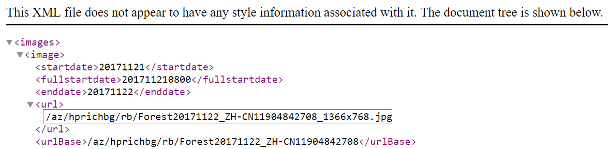

# **Windows壁纸和Bing主页壁纸提取(仅作测试MarkDown)**

### *From Evernote 2016/5/17*

## Win10壁纸设置以及Spotlight壁纸提取

- 在Filer Explorer的地址栏输入
    - <pre>C:\Users\Joshion\AppData\Local\Packages\Microsoft.Windows.ContentDeliveryManager_cw5n1h2txyewy\LocalState\Assets
</pre>

- 此文件夹下所有的文件没有后缀名，但全部是图片文件。将这些文件拷贝出来，并重命名为jpg后缀的文件，即可得到壁纸
- 可使用cmd命令行批量重命名
    - <code>ren *.* *.jpg</code>

## 修改默认锁屏壁纸

- 进入注册列表 Win+R  => regedit
    - <pre>KEY_LOCAL_MACHINE\SOFTWARE\Policies\Microsoft\Windows\Personalization</pre>
- 点击新建项，在右侧新建名为LockScreenImage的字符串值，值设置为壁纸的路径

## 删除自定义的锁屏壁纸

- 首先打开文件夹 C：\ProgramData\Microsoft\Windows\
    - 可以按WIN+R，然后在运行中输入 %ProgramData%\Microsoft\Windows 回车进入
- 找到SystemData 文件夹，这时这个文件夹还不能访问（没有管理员权限），以下方法操作获取全权限：
    - 右键属性 => “安全” => “高级按钮” => “更改”所有者 => “高级” => “立即查找” => 然后选择你登录的管理员帐户 => “确定”
- 此时文件夹就可以打开了，删除其中所有内容即可。
- 然后 按WIN+R 打开运行，输入regedit 回车打开注册表，依次展开
    - <pre>HKEY_LOCAL_MACHINE\SOFTWARE\Microsoft\Windows\CurrentVersion\SystemProtectedUserData</pre>
- 选择 SystemProtectedUserData 后 删除右侧 所有数据（除了默认），项本身不要删除；
- 重启Win10系统后，锁屏无法设置的问题解决！

## 提取Bing主页无水印壁纸
- Bing主页壁纸Api

    - 点击此链接会得到壁纸信息(其中idx为多少天前的主页, 而n为天数)
        - <pre>$bingImageApi = 'http://www.bing.com/HPImageArchive.aspx?format=xml&idx=0&n=10&mkt=zh-cn';</pre>
        - 如 idx=3&n=5, 代表8天前到3天前的壁纸
    - 使用www.bing.com+以下红框中的url即可得到bing无水印壁纸
        - 
        - 可将分辨率改为 1920*1080 或者 2560*1440 获取更大尺寸的超清壁纸
